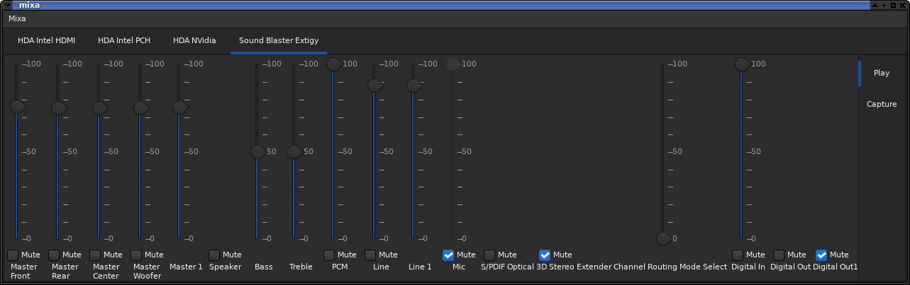

# mixa
A simple mixing application (using functions of alsamixer).

> [!WARNING]
> has issues of Gui-events and Alsa-events crossing.

To setup the requirements use on Debian:
<pre>
apt-get install git build-essential meson libtool
apt-get install libgtkmm-3.0-dev
</pre>

To build use meson:
<pre>
meson setup build -Dprefix=/usr
cd build
meson compile
</pre>

As a option <pre>-Dkeybind=true</pre> is supported to support the media keys
but requires <pre>libkeybinder3</pre> (name may vary)
as additional dependency.